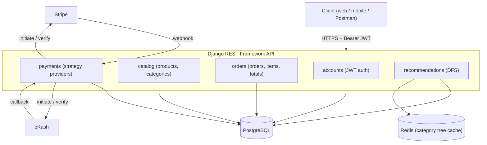

# System architecture

The backend is a Django REST Framework API split into domain apps. Clients talk to the API over HTTP with JWT. Payments go through external providers behind a strategy pattern. Postgres is the store of record; Redis caches the category tree.

## Notes

- Each app owns one domain. Payment providers plug in through a registry, so order logic never changes when a provider is added.
- Stock is reduced only after a verified successful payment, inside an atomic transaction with row locking.
- The category tree is cached in Redis and invalidated by a signal on category change.
