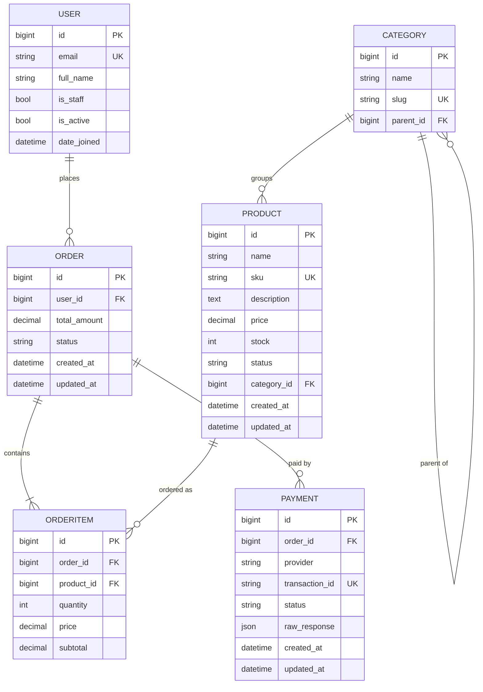

# Entity relationship diagram

Core entities and their relationships. A user places orders; an order holds order items; each item points at a product; a product may belong to a category tree; an order is paid through one or more payment attempts.

## Relationship notes

- USER to ORDER: one user has many orders.
- ORDER to ORDERITEM: one order has one or more items (cascade delete).
- PRODUCT to ORDERITEM: protected, a product referenced by an order cannot be deleted.
- CATEGORY to PRODUCT: a product may have one category or none (set null on delete).
- CATEGORY to CATEGORY: self referential tree via parent (cascade delete to children).
- ORDER to PAYMENT: an order can have several payment attempts; transaction id is unique.
