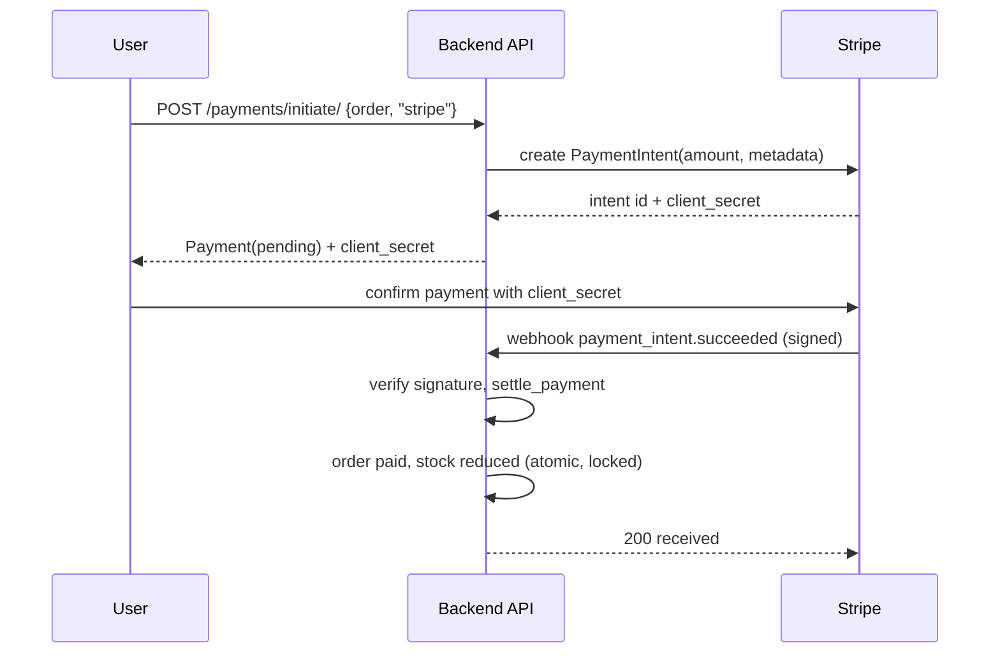
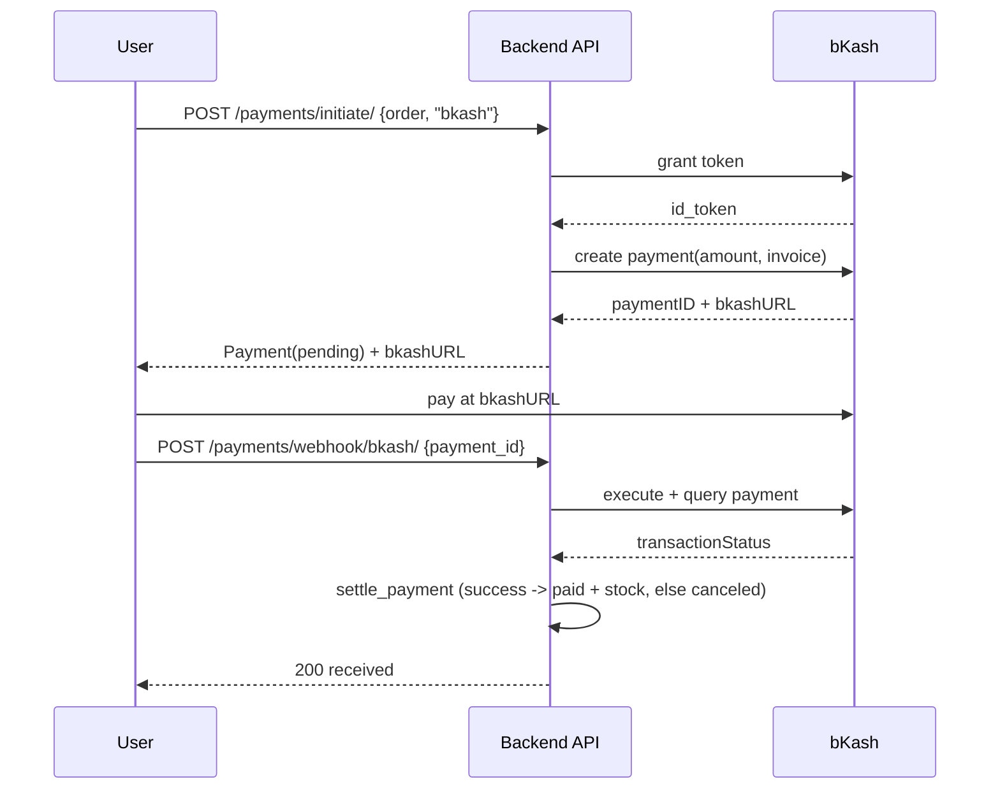

# Payment flow diagrams

Both providers share one shape: initiate a payment, let the provider confirm, verify the result, then settle. Settling marks the order paid and reduces stock atomically, or cancels the order on failure. Settlement is idempotent.

## Stripe

On `payment_intent.payment_failed` or a signature mismatch, the payment is marked failed and the order canceled; stock is untouched.

## bKash

## Settlement rules (both providers)

- Runs in `transaction.atomic`.
- The payment row is locked with `select_for_update`; an already settled payment returns early, so repeated webhooks do not double-apply.
- On success, each product row is locked and re-checked before its stock is reduced, preventing overselling. If stock is short, the payment fails and the order is canceled.
